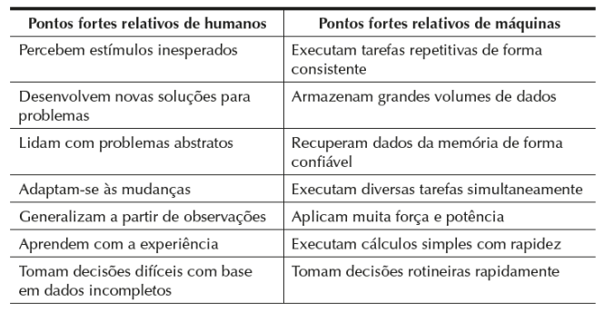
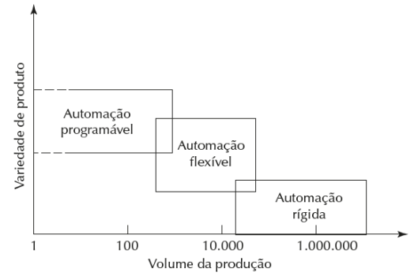

# Introdução à Automação e Sistemas de Produção Industriais - Exercícios

### Questão 1 - Qual alternativa esta errada no que tange aos objetivos da automação industrial:

(a) A automação em muitos casos aumenta a segurança do processo.

(b) A automação sempre aumenta a produção do processo.

(c) A automação em muitos casos aumenta a produção do processo.

(d) A automação aumenta o custo da implementação do processo.

(e) A automação melhora a qualidade do processo.

### Questão 2 - Assinale a alternativa verdadeira sobre a Automação industrial

(a) Tem como objetivo principal manter a conformidade e segurança da produção

(b) É sempre baseada em CLPs (Controladores lógicos programáveis).

(c) Só pode ser realizada por meio de dispositivos digitais.

(d) Só pode ser realizada com o uso de dispositivos pneumáticos

(e) É sempre baseada em linguagem Ladder.

### Questão 3 - Dada a tabela de Pontos fortes e atributos relativos de humanos e máquinas. Assinale a alternativa correta

(a) Em determinados processos totalmente automatizados, um ou mais trabalhadores devem estar presentes para monitorar continuamente a operação e certificar‑se de que a máquina opera conforme as especificações. Exemplos desses tipos de processos automatizados incluem complexos processos químicos, refinarias de petróleo e usinas nucleares. Os trabalhadores não participam ativamente do processo, nunca intervindo.

(b) Pode-se distinguir dois níveis de automação: semiautomatizado e totalmente automatizado.
Uma máquina semiautomatizada executa parte do ciclo de trabalho sob algum tipo de controle de programa, e um trabalhador humano opera a máquina durante o restante do ciclo, carregando‑a e descarregando‑a
ou executando algum outro tipo de tarefa a cada ciclo. Uma máquina totalmente automatizada se difere da anterior por sua capacidade de operar sempre sem a atenção humana.

(c) Uma máquina totalmente automatizada tem a capacidade de operar por períodos longos sem a atenção humana. Essas maquinas precisam da atenção humana, de tempos em tempos para funcionar corretamente.

(d) Sistemas automatizados. São aqueles nos quais um processo é executado por uma máquina sem a participação direta de um trabalhador humano. A automação é implementada por meio de um programa de
instruções combinado a um programa de controle que executa as instruções. Sempre existe distinção clara entre os sistemas trabalhador‑máquina e os sistemas automatizados.

(e) Sistemas trabalhador‑máquina. Nesses tipos de sistemas, um trabalhador humano opera um equipamento
motorizado, tal como uma máquina‑ferramenta ou outra máquina de produção. Esses sistemas são totalmente inviáveis devido as caraterísticas humanas.

### Questão 4 - Os sistemas de produção podem ser divididos em duas categorias ou níveis. Essas são:

(a) Atenção periódica do trabalhador e máquina automatizada

(b) Máquina e processo

(c) Ferramentas manuais comumente usadas e processo

(d) Sistemas de apoio à produção e instalações: fábrica equipamentos

(e) Ferramentas manuais comumente usadas e máquina automatizada

### Questão 5 - Dado o gráfico abaixo é correto afirmar que:

(a) Automação programável. Nesse tipo de automação, o equipamento de produção é projetado com a capacidade
de modificar a sequência de operações de modo a acomodar diferentes configurações de produtos. A sequência de operações é controlada por um programa, um conjunto de instruções codificado de maneira que possa ser lido e interpretado pelo sistema. Novos programas podem ser preparados e inseridos nos equipamentos para fabricaremnovos produtos. Algumas das características da automação programável incluem: 
(1) alto investimento em equipamentos de propósito geral; 
(2) altas taxas de produção se comparada à automação rígida; 
(3) flexibilidade para lidar com variações e alterações na configuração do produto; 
(4) baixa adaptabilidade para a produção em lote

(b) Automação rígida. Sistema no qual a sequência das operações de processamento (ou montagem) é definida pela configuração do equipamento. Normalmente, cada operação na sequência é simples e talvez envolva um movimento linear plano ou rotacional, ou uma combinação simples dos dois, tal como a alimentação de um carretel em rotação. A integração e a coordenação de muitas dessas operações em um único equipamento é o que torna o sistema complexo. Algumas
características da automação rígida são: 
(1) alto investimento inicial em equipamentos com engenharia personalizada; 
(2) altas taxas de produção; 
(3) inflexibilidade relativa do equipamento na acomodação da variedade de produção.

(c) Automação rígida. Sistema no qual a sequência das operações de processamento (ou montagem) é definida pela configuração do equipamento. Normalmente, cada operação na sequência é simples e talvez envolva um movimento linear plano ou rotacional, ou uma combinação simples dos dois, tal como a alimentação de um carretel em rotação.
A integração e a coordenação de muitas dessas operações em um único equipamento é o que torna o sistema complexo. Algumas características da automação rígida são: 
(1) Baixo investimento inicial em equipamentos com engenharia personalizada; 
(2) Baixas taxas de produção; 
(3) inflexibilidade relativa do equipamento na acomodação da variedade de produção.

(d) Automação flexível. É uma extensão da automação programável. Um sistema automatizado flexível é capaz de produzir uma variedade de peças (ou produtos), quase sem perda de tempo e com modificações de um modelo de peça para outro. Não existe perda de tempo de produção enquanto são reajustados o sistema e as configurações físicas (ferramentas, acessórios e configurações de máquina).
Assim, o sistema pode produzir diferentes variações e planos de peças e produtos sem exigir que eles sejam produzidos em lotes. O que viabiliza a automação flexível é que a diferença entre as peças processadas pelo sistema não são significativas e, portanto, o volume de alterações exigidas entre os modelos é mínimo. Dentre as características da automação flexível estão: 
(1) baixo investimento em um sistema com engenharia personalizada; 
(2) produção contínua de um conjunto restrito de produtos; 
(3) taxas baixas de produção; 
(4) inflexibilidade para lidar com variações no projeto do produto 

(e) A justificativa econômica da automação rígida está nos produtos que são fabricados em grandes quantidades e nas altas taxas de produção.
O alto custo inicial do equipamento nunca poderá ser diluído na grande quantidade de unidades, o que torna o custo unitário menos atrativo se comparado a métodos alternativos de produção.

### Questão 6 - Existem três categorias em termos da participação humana nos processos executados pelos sistemas de produção, assinale a falsa:
(a) Sistemas automatizados – um processo executado por uma máquina sem a participação direta de um trabalhador humano.

(b) Sistemas de trabalho manual – um trabalhador executando uma ou mais tarefas sem a ajuda de ferramentas motorizadas, mas às vezes utilizando ferramentas manuais.

(c) Sistemas trabalhador - máquina – um trabalhador operando equipamento motorizado

(d)  Sistemas máquina - trabalhador– um trabalhador operando equipamento motorizado

(e)  Sistemas de trabalho manual – um trabalhador executando uma ou mais tarefas sempre com a ajuda de ferramentas motorizadas

### Questão 7 - Existem muitas circunstâncias em que o trabalho manual é justificado em operações fabris, assinale a falsa:
(a) Para lidar com os altos e baixos da demanda

(b) A tarefa é tecnologicamente muito difícil de ser automatizada

(c) O ciclo de vida do produto é longo

(d) O ciclo de vida do produto é curto

(e) Em alguns países o valor da hora de trabalho é muito baixo, de maneira que a automação não pode ser justificada

### Questão 8 - Assinale qual Não é uma razão para investir em automação de um processo
(a) Realizar processos que não podem ser executados manualmente

(b) Aumentar a segurança do trabalhador

(c) Reduzir o tempo da produção

(d) Reduzir os custos do trabalho

(e) Não melhorar a qualidade do produto