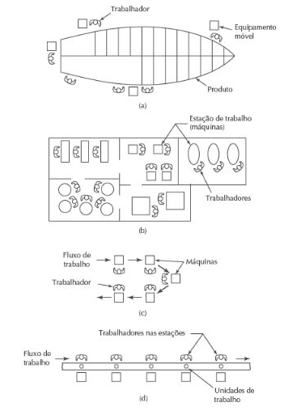
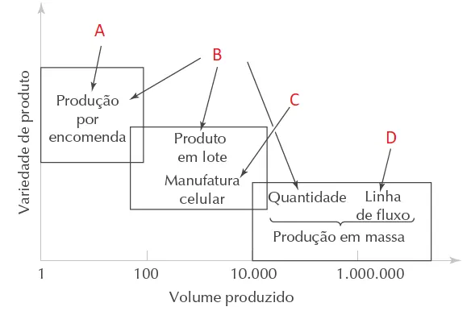

# Automação em Sistemas de Produção e Princípios de Automação - Exercícios

### Questão 1 - Os Layouts indicados na figura são respectivamente:

Escolha uma opção:

(a) 
a. layout de posição fixa; 
b. layout por processo;  
c. layout celular; 
d. layout por produto.

(b) 
a. layout por processo;  
b. layout de posição fixa;  
c. layout por produto; 
d. layout celular.

(c) 
a. layout por processo;  
b. layout de posição fixa;  
c. layout celular; 
d. layout por produto.

(d) 
a. layout de posição fixa; 
b. layout por processo;  
c. layout por produto; 
d. layout celular.

(e) 
a.  layout por processo;  
b. layout por produto; 
c. layout de posição fixa;  
d. layout celular.

### Questão 2 - O princípio USA é uma abordagem de senso comum para os projetos de automação e melhoria dos processos.

 A sigla USA significa (1) compreender (do inglês, understand) o processo existente;
(2) simplificar (do inglês, simplify) o processo; e (3) automatizar (do inglês, automate) o processo.

Assinale a alternativa incorreta sobre o principio USA 

(a) Seguir o princípio USA é um bom começo em um projeto de automação. 
Pode ser que, depois da simplificação do processo, se descubra que a automação é desnecessária ou que seu custo
não se justifica.
Se a automação parecer uma solução viável para aumentar a produtividade, a qualidade ou qualquer outra medida
de desempenho, então as dez estratégias listadas a seguir podem servir de mapa na busca por essas melhorias
1. Especialização das operações.
2. Operações combinadas.
3. Operações simultâneas.
4. Integração das operações.
5. Aumento da flexibilidade.
6. Melhoria na armazenagem e manuseio de materiais.
7. Inspeção on‑line.
8. Otimização e controle do processo.
9. Controle das operações de fábrica.
10. Manufatura integrada por computador (CIM).

(b)Compreender o processo existente. O primeiro passo do princípio USA é a compreensão do processo
atual e de todos os seus detalhes. Quais são os insumos? Quais são os produtos?
 O que acontece exatamente ao produto entre sua entrada e sua saída? 
Qual a função do processo? Como ele acrescenta valor ao produto? 
Quais são as operações iniciais e finais da sequência de produção? 
E elas podem ser combinadas ao processo em questão?

(c) Automatizar o processo. Depois que o processo estiver reduzido a sua forma mais simples, a automação pode ser considerada.

(d) O princípio USA é tão genérico que pode ser aplicado em quase todos os projetos de automação.  A discussão de cada etapa do princípio para um projeto de automação
é importante, mas nunca leva a conclusão que a automação é desnecessária.

(e)
Simplificar o processo. Uma vez compreendido o processo atual, inicia‑se a busca por simplificação.
 Essa etapa normalmente envolve uma lista de perguntas sobre o processo
atual. Qual o propósito dessa etapa ou transporte? A etapa é necessária? Pode ser eliminada? Essa etapa utiliza a
tecnologia mais adequada? Como essa etapa pode ser simplificada?
Existem etapas desnecessárias no processo que podem ser eliminadas sem que se altere a função?

### Questão 3 - Os tipos de instalações (Layouts) de produção indicados na figura são respectivamente:

(a) 
A. Layout de posição fixa 
B. Layout por processo 
C. Layout por produto 
D. Layout celular 

(b) 
A. Layout de posição fixa 
B. Layout celular 
C. Layout por processo  
D. Layout por produto

(c) 
A. Layout de posição fixa 
B. Layout por processo 
C. Layout celular 
D. Layout por produto

(d) 
A. Layout por produto  
B. Layout por processo 
C. Layout celular 
D. Layout de posição fixa

(e) 
A. Layout por processo 
B.  Layout de posição fixa  
C. Layout celular 
D. Layout por produto

---

Respostas: (1-a), (2-d), (3-c).