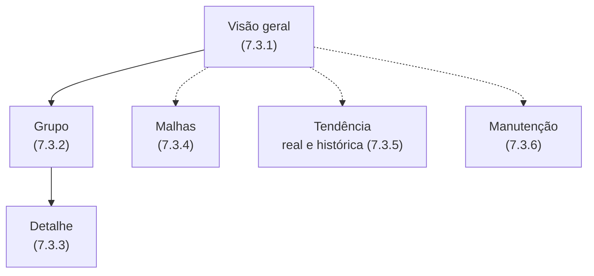
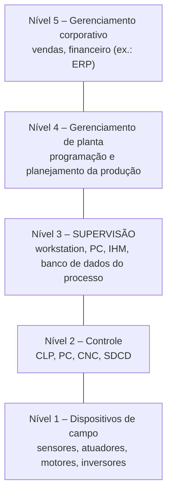
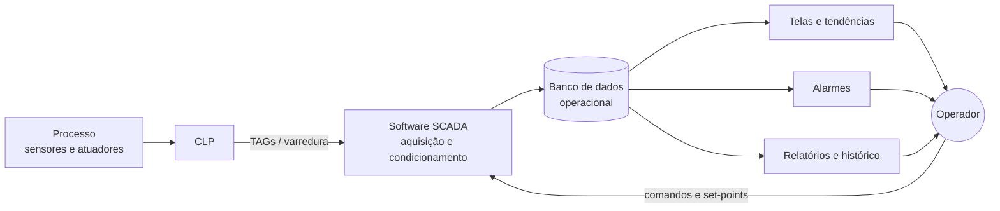
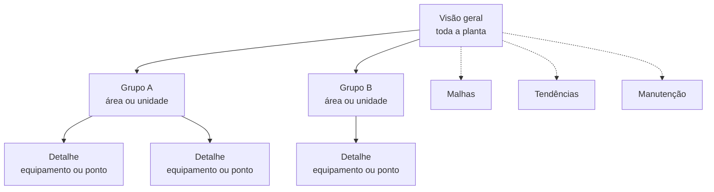
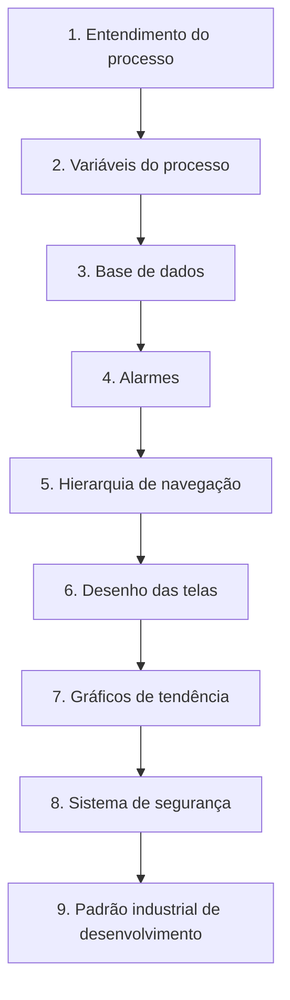

# Sistemas Supervisórios e IHM 

Material de estudo sobre **sistemas supervisórios (SCADA)** e **IHM/HMI** em automação industrial: o que são, como funcionam, quais telas um SCADA deve ter, como se diferenciam de uma IHM e como projetar, operar e proteger um sistema desses.

## Índice

- [Resumo em 1 minuto](#resumo-em-1-minuto)
- [1. Fundamentos de supervisão](#1-fundamentos-de-supervisão)
  - [1.1 O que são sistemas supervisórios](#11-o-que-são-sistemas-supervisórios)
  - [1.2 De onde vieram: os painéis sinóticos](#12-de-onde-vieram-os-painéis-sinóticos)
  - [1.3 Tipos de variáveis de campo](#13-tipos-de-variáveis-de-campo)
  - [1.4 Dois grandes grupos: IHM e SCADA](#14-dois-grandes-grupos-ihm-e-scada)
  - [1.5 Onde o supervisório se encaixa: a pirâmide da automação](#15-onde-o-supervisório-se-encaixa-a-pirâmide-da-automação)
  - [1.6 Quem opera: papéis e atividades (slides 50–51)](#16-quem-opera-papéis-e-atividades-slides-5051)
- [2. Software de supervisão SCADA](#2-software-de-supervisão-scada)
  - [2.1 Papel do software de supervisão](#21-papel-do-software-de-supervisão)
  - [2.2 Tratamento dos dados (Apostila, p. 90)](#22-tratamento-dos-dados-apostila-p-90)
  - [2.3 Dados da estratégia × dados dos pontos (Apostila, p. 91)](#23-dados-da-estratégia--dados-dos-pontos-apostila-p-91)
  - [2.4 As três funções básicas (slides 46–47)](#24-as-três-funções-básicas-slides-4647)
  - [2.5 TAGs: como o CLP "fala" com o supervisório](#25-tags-como-o-clp-fala-com-o-supervisório)
  - [2.6 Modo de desenvolvimento × modo de execução (slides 81–84)](#26-modo-de-desenvolvimento--modo-de-execução-slides-8184)
  - [2.7 Recursos que motivam o uso (slide 53)](#27-recursos-que-motivam-o-uso-slide-53)
  - [2.8 Banco de dados na indústria (slides 101–106)](#28-banco-de-dados-na-indústria-slides-101106)
  - [2.9 Plataforma (slide 138)](#29-plataforma-slide-138)
- [3. Telas de supervisão](#3-telas-de-supervisão)
  - [3.1 Os seis tipos de tela](#31-os-seis-tipos-de-tela)
  - [3.2 Estrutura de árvore e navegação (slides 115–126)](#32-estrutura-de-árvore-e-navegação-slides-115126)
  - [3.3 Boas práticas de projeto das telas (slides 128–134, 145–149)](#33-boas-práticas-de-projeto-das-telas-slides-128134-145149)
  - [3.4 Telas de tendência na prática (slides 132–133)](#34-telas-de-tendência-na-prática-slides-132133)
  - [3.5 Telas de manutenção na prática](#35-telas-de-manutenção-na-prática)
- [4. Alarmes, histórico de falhas e relatórios](#4-alarmes-histórico-de-falhas-e-relatórios)
  - [4.1 Histórico de falhas (Apostila, 7.4)](#41-histórico-de-falhas-apostila-74)
  - [4.2 Relatórios (Apostila, 7.5)](#42-relatórios-apostila-75)
  - [4.3 Resumo da apostila (p. 95)](#43-resumo-da-apostila-p-95)
  - [4.4 Planejamento de alarmes (slides 107–114)](#44-planejamento-de-alarmes-slides-107114)
  - [4.5 Gerenciamento de alarmes (slides 139–149)](#45-gerenciamento-de-alarmes-slides-139149)
- [5. IHM × SCADA](#5-ihm--scada)
  - [5.1 IHM / HMI (Interface Homem-Máquina)](#51-ihm--hmi-interface-homem-máquina)
  - [5.2 SCADA](#52-scada)
  - [5.3 Comparação direta (slides 150–151)](#53-comparação-direta-slides-150151)
  - [5.4 Principais produtos do mercado (slides 29, 44; videoaulas)](#54-principais-produtos-do-mercado-slides-29-44-videoaulas)
- [6. Projeto, níveis de acesso e cibersegurança](#6-projeto-níveis-de-acesso-e-cibersegurança)
  - [6.1 Etapas de planejamento de um supervisório (slide 85)](#61-etapas-de-planejamento-de-um-supervisório-slide-85)
  - [6.2 Níveis de acesso (slides 135–137; videoaulas)](#62-níveis-de-acesso-slides-135137-videoaulas)
  - [6.3 Cibersegurança em sistemas SCADA (slides 152–160, 191–194)](#63-cibersegurança-em-sistemas-scada-slides-152160-191194)
- [7. Glossário, checklist de revisão e referências](#7-glossário-checklist-de-revisão-e-referências)
  - [7.1 Glossário](#71-glossário)
  - [7.2 Checklist de revisão](#72-checklist-de-revisão)
  - [7.3 Referências](#73-referências)
- [Sobre as fontes e as figuras](#sobre-as-fontes-e-as-figuras)

## Resumo em 1 minuto

- **SCADA** (*Supervisory Control and Data Acquisition*) é o sistema de supervisão e controle que **coleta dados do processo** por meio de remotas industriais (principalmente **CLPs**), formata esses dados e os apresenta ao operador **em tempo real**, permitindo **monitorar e atuar** no processo. *(Apostila, p. 89)*
- O software de supervisão fica no **nível de controle do processo** das redes de comunicação, adquire dados dos CLPs, converte para **unidades de engenharia**, guarda em um **banco de dados** e permite configurar **limites de alarme** por ponto. *(p. 90)*
- Cada ponto é identificado por um **TAG** (variável de entrada/saída). *(p. 91)*
- As telas se organizam em **estrutura hierárquica em árvore** e há seis tipos principais: visão geral, grupo, detalhe, malhas, tendência e manutenção. *(p. 92–94)*
- O histórico de falhas e os relatórios usam os dados guardados no banco do supervisório. *(p. 95)*

### Mapa das telas (Apostila, seção 7.3)

### IHM × SCADA em uma tabela

| | **IHM / HMI** | **SCADA** |
|---|---|---|
| Escala | Máquina ou processo único; centenas de pontos | Muitos processos/máquinas; até centenas de milhares de pontos |
| Onde fica | Junto à máquina (chão de fábrica, ambiente agressivo) | Em geral longe das máquinas (sala de controle) |
| Histórico/banco de dados | Limitado ou inexistente | Quase sempre armazena dados |
| Recursos gráficos | Mais limitados | Interface gráfica mais rica |

Detalhes e fontes em [seção 5 – IHM × SCADA](#5-ihm--scada).

## 1. Fundamentos de supervisão

> Base: Apostila, Aula 7, seção 7.1 (p. 89) · Slides 2–8, 22, 45, 50–52, 185–189 · Videoaulas

### 1.1 O que são sistemas supervisórios

**Sistemas supervisórios** são sistemas digitais de monitoração e operação da planta que **gerenciam variáveis de processo**. Essas variáveis são atualizadas continuamente e podem ser guardadas em bancos de dados locais ou remotos para registro histórico.

#### Por que são usados

Na indústria é preciso **centralizar a informação**, tendo o máximo de dados no menor tempo possível. Painéis centralizados atendem em parte, mas a sala de controle pode ter grandes extensões com **centenas ou milhares de instrumentos**, tornando o trabalho do operador "uma verdadeira maratona" (Apostila, p. 89).

Outro motivo, apontado nos slides: **circuitos elétricos e linguagens de programação não são fáceis de entender para pessoas leigas**. Uma tela gráfica traduz o processo para uma forma que o operador interpreta rapidamente.

#### Objetivo principal do SCADA

Propiciar uma **interface de alto nível entre o operador e o processo**, informando-o **"em tempo real"** de todos os eventos importantes da planta e permitindo que ele **atue e monitore** o processo (Apostila, p. 89, Fig. 7.1).

### 1.2 De onde vieram: os painéis sinóticos

Antes dos supervisórios, a solução era o **painel sinótico**: uma placa na parede com luzes, chaves e botões físicos que **representam e atuam no processo**, às vezes com medidores e registradores de papel com canetas traçando gráficos.

**Limitações citadas nas videoaulas:**

- **Pouca flexibilidade:** depois de pronto, é difícil mexer. Incluir um equipamento novo exige furar a chapa ou improvisar, o que aumenta o risco de confusão e de erro.
- **Espaço físico:** quanto mais equipamentos, maior o painel.
- **Manutenção do próprio painel:** lâmpadas de sinalização queimam e é preciso um teste de lâmpadas para perceber isso.
- **Registro em papel:** os gráficos históricos dependem de rolos de papel que alguém precisa ler e arquivar.

O supervisório aparece como a evolução natural: o "painel" passa a ser uma tela, **flexível e fácil de alterar**.

### 1.3 Tipos de variáveis de campo

Em todo processo industrial há dois tipos básicos de variáveis:

| Tipo | Característica | Exemplos |
|---|---|---|
| **Digital** | Apenas dois estados discretos (1/0) | Motor ligado/desligado, lâmpada acesa/apagada, equipamento em falha/normal |
| **Analógica** | Assume valores dentro de uma faixa | Velocidade, temperatura de um forno, corrente de um motor, pressão em uma tubulação |

### 1.4 Dois grandes grupos: IHM e SCADA

Os supervisórios se classificam pela **complexidade, robustez e número de entradas e saídas monitoradas**:

1. **IHM / HMI** (*Interface Homem-Máquina*): mais simples, junto à máquina.
2. **SCADA**: mais complexo, para grandes quantidades de pontos.

A comparação completa está em [seção 5 – IHM × SCADA](#5-ihm--scada).

### 1.5 Onde o supervisório se encaixa: a pirâmide da automação

*(Slide 45.)* O software de supervisão fica **acima dos CLPs**, que executam o controle, e **abaixo** do planejamento da produção e da gestão corporativa. A apostila o situa no **"nível de controle do processo"** das redes de comunicação (p. 90).

Os protocolos de rede variam por nível: Ethernet/TCP-IP nos níveis superiores; ControlNet, Profibus FMS e Fieldbus HSE no nível de controle; Fieldbus H1, CAN, Profibus DP/PA, HART, AS-i, LonWorks e InterBus no nível de campo.

> ⚠️ **Variação entre slides.** Outra versão da pirâmide nos mesmos slides (186–187) descreve os níveis de forma um pouco diferente: Nível 1 = comando de máquinas (CNC, CLP, controladores de processo); Nível 2 = **sistemas de supervisão e controle**; Nível 3 = MES, LIMS, PIMS e gestão de ativos; Nível 4 = planejamento da produção; Nível 5 = ERP. A ideia central é a mesma (supervisão entre o controle e a gestão), mas a numeração muda. Confirme qual adotar com o professor.

#### O que mudou com a Indústria 4.0

Os slides 188–192 discutem que a pirâmide deixa de ter comunicação apenas "de baixo para cima" e passa a ter **alta conexão**, com SCADAs ligados a redes corporativas. Isso traz ganhos de integração e também riscos de segurança (ver [seção 6 – Projeto e segurança](#6-projeto-níveis-de-acesso-e-cibersegurança)).

### 1.6 Quem opera: papéis e atividades (slides 50–51)

| Papel | Função |
|---|---|
| **Operador externo** | Trabalhador que interfere diretamente sobre a instalação |
| **Operador de processo** | Conduz o processo a partir de painéis, telas ou mostradores, em sala de controle |
| **Chefe de posto** | Responsável pela equipe de operadores de processo |
| **Instrumentalista** | Intervém diretamente na regulagem e no conserto de instrumentos |

- **Operação normal:** a atividade é essencialmente de **vigilância**, detectando defeitos antes que causem consequências graves, por observação sistemática dos indicadores essenciais.
- **Operação sob contingência:** vários eventos simples ocorrem ao mesmo tempo (por exemplo, pequenos consertos em aparelhos) e a presença do operador é necessária.

Por isso o projeto das telas e dos alarmes precisa considerar o operador em **situação de estresse** (ver [seção 4 – Alarmes](#4-alarmes-histórico-de-falhas-e-relatórios)).

## 2. Software de supervisão SCADA

> Base: Apostila, Aula 7, seção 7.2 (p. 90–92) · Slides 46–49, 53–84, 101–106, 138

### 2.1 Papel do software de supervisão

O software de supervisão, localizado no **nível de controle do processo** das redes de comunicação, é responsável por:

1. **Adquirir dados** diretamente dos **CLPs** para o computador;
2. **Organizar, utilizar e gerenciar** esses dados.

Ele pode ser configurado com **taxas de varredura (scan) diferentes** entre CLPs e até entre pontos de um mesmo CLP (Apostila, p. 90).

### 2.2 Tratamento dos dados (Apostila, p. 90)

- Os dados adquiridos são **condicionados e convertidos em unidades de engenharia** (formato simples ou ponto flutuante) e armazenados em um **banco de dados operacional**.
- A configuração **individual de cada ponto**, supervisionado ou controlado, permite definir: **limites de alarme**, condições e textos para cada estado do ponto e valores para conversão em unidade de engenharia.
- O software deve permitir **estratégias de controle** com funções avançadas, por meio de módulos dedicados a **funções matemáticas e booleanas**, de modo que parte do controle das funções do processo possa ser feita no próprio software de supervisão.
- Os dados podem ser manipulados para gerar valores de parâmetros de controle como **set-points**.
- Os dados ficam em **arquivos padronizados**, acessíveis por **programas de usuário** para cálculos e alteração de parâmetros e valores (Fig. 7.2).

### 2.3 Dados da estratégia × dados dos pontos (Apostila, p. 91)

| | Dados da **estratégia** | Dados dos **pontos** |
|---|---|---|
| Alcance | Gerais, afetam todo o banco | Individuais |
| Exemplos | Configuração de impressoras, tipos de equipamentos conectados, senhas | **TAGs** (variáveis de I/O), descrições, limites de alarme, taxa de varredura |

A Figura 7.3 (*App Browser*) mostra um atalho típico para a **seleção de TAGs**.

**Alterações on-line.** As modificações podem ser feitas com o sistema **"on-line"** (ligado, "à quente"). Depois de configurada a estratégia, o software deve executar, gerenciar e armazenar os resultados de cálculos e operações, o estado dos pontos e as demais informações no banco (Apostila, p. 92).

**Estrutura das telas.** O conjunto de telas deve permitir **controlar e supervisionar toda a planta**, organizado em **estrutura hierárquica em árvore**, com acesso sequencial e rápido (p. 92). Veja [seção 3 – Telas](#3-telas-de-supervisão).

### 2.4 As três funções básicas (slides 46–47)

| Função | O que inclui |
|---|---|
| **Supervisão** | Monitoramento: sinóticos, gráficos de tendência de variáveis analógicas e digitais, relatórios em vídeo e impressora |
| **Operação** | Substitui as funções da mesa de controle: liga/desliga de equipamentos, sequências de operação, **malha PID**, mudança de modo de operação |
| **Controle** | Duas formas, abaixo |

**Formas de controle:**

- **Controle DDC** (*Digital Direct Control*): linguagem dedicada para definir ações de controle **diretamente**, sem nível intermediário (como uma estação remota). Usa cartões de I/O ligados diretamente ao barramento do micro.
- **Controle supervisório:** os algoritmos são executados por uma **unidade terminal remota** e os **set-points** são ajustados dinamicamente pelo supervisório conforme o comportamento global do processo. Segundo os slides, é **mais confiável que o DDC**.

> 💡 No caso das IHMs, o controle do processo é sempre feito pelo CLP; um problema na IHM não prejudica a automação da planta (slide 25).

### 2.5 TAGs: como o CLP "fala" com o supervisório

A comunicação entre CLP e supervisório usa **endereços de memória do CLP**. No supervisório, cada endereço recebe um "apelido" (*nick name*): o **TAG**, que indica a variável representada e pode incorporar informações do equipamento de origem, do destino e da área (slides 88–92).

**Origem do dado (slide 49):**

| Tipo | Significado |
|---|---|
| **Device** | Os dados vêm dos CLPs |
| **DDE** (*Dynamic Data Exchange*) | Os dados vêm de um servidor DDE |
| **Memory** | O dado existe localmente no supervisório (variável auxiliar) |

#### Exemplo de nomenclatura (slide 92): TAG `FT116`

Em uma linha de bobinas de aço, a vazão de soda cáustica (NaOH) é medida para controle do pH do banho de limpeza alcalina. A TAG `FT116` se lê assim:

| Posição | Dígito | Significado |
|:---:|:---:|---|
| 1º | F | Tipo: medidor de fluxo |
| 2º | T | Tipo: transmissor de sinal |
| 3º | 1 | Nº da linha de processo onde está o instrumento |
| 4º | 1 | Área de uso (aqui, limpeza alcalina, "área 1") |
| 5º | 6 | Natureza da variável lida: vazão |

> Os slides observam que firmas de engenharia podem repetir TAGs padronizadas entre plantas semelhantes, mas isso **não deve ser tomado como padrão** nas empresas brasileiras. A simbologia de instrumentação segue a **norma ISA**.

**Boas práticas de TAGs (slides 95–97):** nomes que identifiquem claramente o instrumento; associação às áreas; **pastas por grupo de TAGs** para facilitar localização e depuração.

### 2.6 Modo de desenvolvimento × modo de execução (slides 81–84)

Em geral o pacote tem duas partes:

- **Development Time (desenvolvimento):** onde se criam as telas, **vinculam-se TAGs às propriedades dos objetos gráficos** e aos efeitos de animação, e se programam as taxas de gravação de histórico e atualização.
- **Run Time (execução):** onde roda a janela animada criada no desenvolvimento; permite monitorar o processo ou controlar a planta.

### 2.7 Recursos que motivam o uso (slide 53)

Facilidade de interpretação · Flexibilidade · Estrutura do processo · Geração de receitas · Scripts · Rastreabilidade de informações · Facilidade de operação.

#### Animação (slide 54)
Objetos do processo podem ter **cor, largura, posição, espessura e visibilidade** ligadas a variáveis, chegando até ao **envio de e-mails** com o estado da planta.

#### Scripts (slides 63–76)
Módulos de linguagem de programação para adicionar funções especiais. São **sempre associados a eventos**, internos (mudança de valor de uma variável) ou ligados a grandezas físicas (temperatura de uma caldeira em um TAG).

- Estruturas de controle de fluxo: `If…Then…Else…EndIf`, `For…Next`, `While…End`, `Repeat…Until`.
- **Tipos de script:** de **aplicação** (inicialização, durante a execução, finalização), de **tela** (abertura, enquanto aberta, fechamento), de **condição** (verdadeiro, falso, enquanto verdadeiro/falso), de **mudança de variável** e de **teclas de atalho** (ao apertar, enquanto pressionado, ao soltar).
- **Cuidados:** tipos incompatíveis (string em atributo booleano), divisão por zero, erros de sintaxe ou semântica, limites do pacote, scripts muito longos e **laços infinitos**.

#### Receitas (slides 61–62)
Conjuntos de valores pré-definidos (por produto) enviados ao processo por telas de entrada. As videoaulas alertam: o supervisório atende **receitas simples**; em processos muito complexos de batelada, o mais indicado é **software específico de receitas**, pois soluções improvisadas tendem a virar problema de manutenção.

#### Rastreabilidade (slide 77)
Facilita registrar e consultar dados históricos, por exemplo para **resgatar as características de um lote produzido** ou enviar ao cliente o registro de qualidade.

### 2.8 Banco de dados na indústria (slides 101–106)

- Características desejadas de um SGBD: **suporte à comunicação em rede**, **capacidade de armazenamento** e **segurança** contra alteração por usuário não habilitado.
- Praticamente todo sistema de banco de dados suporta **SQL** (padronizado entre o fim dos anos 70 e o início dos 80).
- A maioria dos supervisórios acessa bancos por **fontes de dados ODBC**, sem conexão direta.
- Antes de cadastrar variáveis: ajustar a **classe de SCAN** (tempo de leitura no CLP), criar uma **convenção de nomes** e usar **pastas** para organizar.
- As videoaulas reforçam que **lidar com banco de dados é uma das razões de preferir SCADA a IHM**.

### 2.9 Plataforma (slide 138)

Predomina a plataforma **Windows**, buscando integração com outros produtos do ambiente (como Excel). A **aquisição de dados em tempo real** é um fator primordial na escolha do produto, para que o sistema seja confiável para o operador.

## 3. Telas de supervisão

> Base: Apostila, Aula 7, seção 7.3 (p. 92–95, figuras 7.4 a 7.7) · Slides 115–134, 184

O conjunto de telas deve permitir ao operador **controlar e supervisionar completamente a planta**, organizado em **estrutura hierárquica do tipo árvore**, com acesso sequencial e rápido (Apostila, p. 92).

### 3.1 Os seis tipos de tela

| Seção | Tipo | Para que serve | Dados e ações típicas |
|:---:|---|---|---|
| 7.3.1 | **Visão geral** | Visão **global** do processo, de visualização imediata na operação da planta | Dados mais significativos e objetos com **características dinâmicas**, representando o estado de grupos de equipamentos e áreas. Resume os principais parâmetros monitorados/controlados |
| 7.3.2 | **Grupo** | Representa **cada processo ou unidade**, relacionando funções de uma área | Objetos dinâmicos com estado/condição dos equipamentos; **valores quantitativos** dos parâmetros; permite **acionar** equipamentos (abrir/fechar, ligar/desligar) e **alterar** set-points, limites de alarme e modos de controle |
| 7.3.3 | **Detalhe** | Atende **pontos e equipamentos individuais** | Objetos dinâmicos quando possível; **todos os parâmetros** do ponto; permite alterar parâmetros do equipamento, limites e dados de configuração |
| 7.3.4 | **Malhas** | Mostra o **estado das malhas de controle** | Para as variáveis controladas: **set-points**, limites e condição dos alarmes, valor atual e valor calculado, em **gráfico de barras e valores numéricos** |
| 7.3.5 | **Tendência** (histórica e real) | Comportamento das variáveis ao longo do tempo | Normalmente padrão do software básico; apresenta, **em média, seis variáveis simultaneamente**, em gráfico ou tabela, em **tempo real (on-line)** ou **histórico (off-line)**, a partir de arquivos em disco |
| 7.3.6 | **Manutenção** | Problemas, alarmes, defeitos e dados de manutenção | **Histórico de falhas**, programa de manutenção (**corretiva e preventiva**) e informações gerais dos equipamentos (comerciais, assistência técnica). O exemplo da Fig. 7.7 é uma tela de controle de uma **turbina** |

> 📖 **Figuras da apostila:** 7.4 (visão geral), 7.5 (malhas), 7.6 (tendência) e 7.7 (manutenção). Consulte as páginas 92 a 95 da apostila.

#### Leitura rápida: do geral ao específico

À medida que o operador navega, as telas fornecem **progressivamente mais detalhe** da planta e de seus constituintes (slide 124).

### 3.2 Estrutura de árvore e navegação (slides 115–126)

- **Tela(s) principal(is)** ou de nível superior → **telas secundárias** (2º nível) → **telas de 3º nível** e telas simplificadas/auxiliares (*pop-ups*).
- Boa estratégia de navegação = **sistema claro**; use botões de navegação em todas as telas.
- Distribuição das telas deve permitir:
  - **acesso rápido** entre telas do mesmo nível;
  - **acesso hierarquizado por níveis funcionais**: **Visualização, Operação e Manutenção**;
  - **restrição por senha** a conjuntos de telas de um mesmo "ramo" da árvore.
- Crie uma **biblioteca de formas (*templates*)** para duplicar objetos e padronizar. Os padrões vêm dos próprios softwares ou de normas internacionais (símbolos **ISA**).

### 3.3 Boas práticas de projeto das telas (slides 128–134, 145–149)

#### Consistência
- Mesmas posições para letras dentro de botões e objetos.
- Objetos repetidos sempre no mesmo lugar (ex.: botão de retorno à tela principal sempre à esquerda, botão de emergência sempre à direita).
- Mesmo uso de símbolos, cores e nomes de botões.
- Comece cada nova tela a partir de uma **cópia da anterior**, mantendo elementos comuns: **títulos, nomes-chave dos TAGs e botões de navegação**.

#### Clareza
- **Símbolos padronizados** (norma ISA para válvulas e tanques).
- **Não sobrepor objetos**; usar TAGs padronizados.
- **Cores conhecidas**, por exemplo **parado = vermelho** e **em movimento = verde**.
- **Não sobrecarregar** a tela de informação; terminologia clara e **sem abreviações** que o usuário não entenda.

#### Uso em telas sensíveis ao toque
- Botões **largos o suficiente** e em posições de fácil acionamento.
- Os botões que ativam uma tela **não podem ficar bloqueados por um *pop-up***.
- **Escreva ou simbolize** a função dos botões e peça a opinião do cliente final sobre clareza e funcionalidade.
- Cuidado com telas que chamam outras telas.

#### Princípios do ASM para gráficos de processo (slides 145–147)
Os conceitos do consórcio ASM são "espartanos": gráficos **bidimensionais**, de **cor predominante cinza**, com **alarmes e variáveis em cores chamativas** para se destacarem. Telas "como obra de arte" (fluidos que fluem, misturadores que giram) chamam atenção demais e podem distrair em situação crítica. O ASM organiza orientações em 16 grupos, entre eles tipo de tela, estilo e *layout*, técnica de navegação, **uso de cor**, símbolos, texto e números, anunciação sonora e visual, treinamento e gerenciamento de mudanças.

### 3.4 Telas de tendência na prática (slides 132–133)

Mostram como variáveis mudam no tempo. Os dados podem vir **em tempo real** (amarrados ao tempo de scan dos CLPs) ou de **histórico arquivado**. As tendências históricas servem para:

- analisar tendências do processo;
- monitorar a **eficiência da produção**;
- **arquivar variáveis** para cumprir exigências legais ou regulatórias.

### 3.5 Telas de manutenção na prática

Os slides (184) e as videoaulas mostram um exemplo: a tela de manutenção lista **todos os motores da planta**, para que servem e **há quantas horas estão funcionando (horímetro)**, permitindo programar a manutenção preventiva e notar motores mais exigidos que outros.

> 🔗 Continua em [seção 4 – Alarmes, histórico e relatórios](#4-alarmes-histórico-de-falhas-e-relatórios), que trata do **histórico de falhas** e dos **relatórios** (itens 7.4 e 7.5 da apostila).

## 4. Alarmes, histórico de falhas e relatórios

> Base: Apostila, Aula 7, seções 7.4, 7.5 e Resumo (p. 95) · Slides 77, 107–114, 139–149 · Videoaulas

### 4.1 Histórico de falhas (Apostila, 7.4)

O documento de **histórico de falhas por equipamento ou área** fica armazenado em **arquivos no banco de dados** do software de supervisão. Isso permite:

- tratar essas informações em **telas orientadoras à manutenção** (ver a tela de manutenção em [seção 3](#3-telas-de-supervisão));
- usar **programas de usuário** para gerar **estatísticas de utilização e de defeitos**.

### 4.2 Relatórios (Apostila, 7.5)

O software básico de supervisão possui um **módulo de desenvolvimento de relatórios**.

- Relatórios **históricos** são criados em **formatos padrão** e permitem ao operador **escolher as variáveis** que deseja ver.
- Os dados podem aparecer nas telas das estações com campos de identificação: **TAG, data, hora e descrição do ponto**.
- O operador pode **solicitá-los manualmente**, destinando-os a **impressoras ou terminais de vídeo**.
- Os dados históricos ficam **armazenados em arquivos**, acessíveis pelos programas de relatórios, e podem ser guardados em **meios magnéticos** para uso futuro.

#### Rastreabilidade (slide 77)
Supervisórios e IHMs atuais facilitam registrar e manipular **dados históricos**, permitindo, por exemplo, **resgatar as características de um lote** ou enviar ao cliente o registro de qualidade.

### 4.3 Resumo da apostila (p. 95)

O software de supervisão e controle, parte integrante do SCADA, **recebe as informações dos controladores concentrando todos os eventos ocorridos**. Permite que o operador **visualize imediatamente** o que acontece em cada processo, o que possibilita **alterar os parâmetros de controle** conforme a necessidade.

### 4.4 Planejamento de alarmes (slides 107–114)

Alarmes são o conjunto de variáveis (TAGs) mostradas e/ou registradas durante a operação da planta. Ao planejar, defina:

1. **Quais condições disparam** o alarme (nível, valor, composição de eventos etc.).
2. **Como o alarme informa** o operador: sonoro, visual, sonoro-visual, *banner* na área, e-mail, *pager* etc.
3. **Quais informações** o alarme traz: valor alarmado, hora da atuação, hora do reconhecimento etc.
4. **Como o operador reconhece** o alarme.

**Funções do alarme:** chamar a atenção do operador para a mudança de estado do processo, sinalizar que um objeto foi atingido e dar uma indicação global do estado do processo.

**Formas de intervir** sobre um alarme: suprimir o sinal sonoro, intervir direto na tela, aceitar (ou não reconhecer) o alarme. O supervisório registra o ***time-stamp*** da ocorrência e do reconhecimento.

**Pré-alarmes (alarmes normais):** não exigem intervenção e não implicam situação perigosa que peça análise cuidadosa.

> 💡 **Alarme não é evento.** A videoaula chama atenção para um erro comum de projeto: tratar todo evento como alarme enche o histórico de alarmes e esconde o que importa. Alarmes são os eventos **relevantes** (que exigem ação do operador); os demais eventos podem ser **registrados no histórico**, mas não devem ser configurados como alarme.

#### Níveis de alarme por variável analógica
Com os sistemas digitais, cada entrada analógica passa a ter **4 ou 5 níveis de alarme** (slide 139). Uma convenção usual é falar em limites muito baixo, baixo, alto e muito alto (LL, L, H, HH).

#### Hierarquização e contexto (slides 112–113)
Pontos críticos: o **aparecimento simultâneo de muitos alarmes** e a **repetição excessiva** de certos alarmes. É preciso filtrar a informação e projetar os alarmes para **guiar o operador** em direção ao grupo de indicadores envolvido, partindo da análise das **causas** e chegando à antecipação das **ações** que restabelecem a situação desejada.

### 4.5 Gerenciamento de alarmes (slides 139–149)

#### O problema
Com a facilidade de criar alarmes digitais, as salas de controle passam a ter **milhares de condições alarmáveis**, e surgem alarmes ruins:

| Tipo | Descrição |
|---|---|
| **Oscilantes** (*chatter*) | Sem histerese adequada, entram e saem de alarme com frequência e acabam ignorados |
| **Perenes** | Vivem em estado constante de alarme e também são ignorados |
| **Inúteis** | Não indicam situação necessariamente importante; só perturbam a atenção |
| **Os que importam** | Deveriam provocar reação rápida e eficaz, mas se perdem no meio dos demais |

#### ASM e EEMUA
Em meados dos anos 1990 formou-se o **consórcio ASM** (*Abnormal Situation Management*) para pesquisar as causas de situações anormais. Segundo os slides, os incidentes resultavam da interação de três fatores: **fator humano (40%)**, **problemas de processo (20%)** e **problemas de equipamento (40%)**. O trabalho se juntou ao da **EEMUA** (Reino Unido) e, em **1999**, surgiu o guia *Alarm Systems – A Guide to Design, Management and Procurement* (EEMUA 191).

**Finalidade de um alarme (EEMUA 191):**
- alertar, informar e orientar o operador;
- ser **relevante e útil**, provocando **resposta definida**;
- ocorrer **com tempo suficiente** antes do perigo para permitir ação corretiva;
- fazer parte de um sistema que considera as **limitações humanas sob estresse**;
- ajudar a manter a planta **dentro de limites seguros**.

#### Alarmes × alertas
Quem segue as orientações do ASM/EEMUA costuma **reduzir à metade ou mais** a quantidade de alarmes. Variáveis que não se qualificam como alarme devem entrar em um **sistema de alertas**, que são **prenúncios** de situações de alarme.

#### O dia seguinte
O sistema de alarmes é **dinâmico**. É preciso **arquivar os dados** para estudar causas e efeitos depois de uma ocorrência e verificar se os operadores seguem o sistema ou o alteram, avaliando se as mudanças são **justificadas** (temporárias ou revelando falha de projeto) ou **contrariam os objetivos** do sistema.

#### O aspecto humano
Reunir **conhecimento de processo e de operação**, **treinar** os operadores, considerar a **ergonomia** e perguntar como apresentar informação **sem uma avalanche de dados** e como os operadores reagem sob estresse.

## 5. IHM × SCADA

> Base: Slides 8–15, 22–44, 150–151, 177–179 · Videoaulas (IHM/HMI e SCADA) · Apostila 7.1 (definição de SCADA)

### 5.1 IHM / HMI (Interface Homem-Máquina)

Sistema normalmente usado **no chão de fábrica**, em ambiente geralmente **agressivo**. A construção é **extremamente robusta**, resistente a **jato d'água direto, umidade, temperatura e poeira**, conforme o **grau de proteção (IP)** necessário. As aplicações vão de simples lavadoras de louça até a cabine de aeronaves.

- Usada onde o número de entradas e saídas é **reduzido (centenas de pontos)**.
- Fica **junto à linha de produção**, na estação de trabalho, **traduzindo os sinais do CLP em sinais gráficos** de fácil entendimento.
- **Não controla** a máquina ou o processo: **o controle é do CLP**. Um problema na IHM não prejudica a automação (slide 25).
- Em sentido amplo, quadros sinóticos, software de supervisão e IHMs são todos **interfaces homem-máquina**, pois há interação entre operador e máquina (slide 26).

#### Para que serve (slides 11, 27, 179)
Visualizar **alarmes**; ver **dados de motores e equipamentos** de uma linha; ver **dados de processo da máquina**; **alterar parâmetros** do processo; operar componentes em **modo manual**; alterar configurações de equipamentos. Em máquinas **CNC**, IHMs dedicadas são imprescindíveis porque o operador interage diretamente com a máquina.

Na lista "por que precisamos de IHMs": configuração de máquinas, controle de processo, redução de custos, interações seguras, notificações aos operadores e facilidade de supervisão.

#### Vantagens (slides 10, 12)
- Economia de **fiação e acessórios** (a comunicação com o CLP é serial, em um ou dois pares trançados, poupando pontos de I/O e a fiação de sinaleiros e botões).
- **Redução de mão de obra** de montagem (monta-se uma IHM em vez de vários dispositivos).
- **Eliminação física do painel sinótico** e menor dimensão física do painel.
- Maior **capacidade de comando e controle** e **flexibilidade** diante de alterações no campo.
- **Operação amigável**; **fácil programação e manutenção**.

#### Limitações (slides 13, videoaulas)
- **Número de variáveis** (principal limitação).
- **Pouco ou nenhum armazenamento de históricos.**
- **Recursos visuais limitados** (resolução baixa; modelos antigos tinham poucas cores e poucas teclas de função).
- **Não gerencia bancos de dados.**
- Maior **dependência de hardware**, normalmente mais difícil e caro de atualizar, e de software dedicado do fabricante.

#### Como a IHM conversa com o CLP (slides 31–39)

| Forma | Como funciona |
|---|---|
| **1. Comunicação direta** | A mais usada. Depende do **protocolo elétrico** (RS-232, RS-485, TTY) e do **protocolo de comunicação** do CLP. Ex.: um CLP Rockwell SLC500 usa RS-232 e protocolo DF1, então a IHM precisa de porta RS-232 e do DF1 em sua biblioteca de protocolos |
| **2. Rede de chão de fábrica (Fieldbus)** | Redes como Interbus, Profibus-DP e DeviceNet. Exige hardware adicional (on-board ou placa em slot) |
| **3. Nível superior de rede** | Redes de maior capacidade (ControlNet, Ethernet, Profibus-DP). A IHM entra como **um dos mestres** da rede |
| **4. IHM com I/O ou CLP incorporado** | Para pequenas aplicações: menos espaço no painel, menos fiação, comunicação CLP–IHM mais rápida e menor custo |

#### Como especificar (slides 40–42)
Diz-se que a escolha é **60% preço e 40% necessidade**. Perguntas básicas: só texto ou **gráficos**? Qual a **resolução**? Tamanho **grande ou pequeno**? **Colorido ou monocromático**? **Touch-screen** ou botões de função (e **quantas teclas**)? **Como se comunica** com o CLP? Precisa de **teclado alfanumérico**? Dá para ligar **impressora**? Quais **recursos de software** exigirá?

### 5.2 SCADA

Foi criado como **solução para as limitações das IHMs**, para supervisão e controle de **quantidades enormes de pontos** (até **centenas de milhares**) de entradas e saídas, digitais e analógicas, **distribuídas**. Tem **interfaces gráficas** capazes de representar de forma mais fiel o sistema monitorado (slides 14, 43).

Costuma ficar **longe das máquinas**, em uma **sala de controle** confortável, e se liga a **vários CLPs** em redes industriais (Modbus+, DH+ etc.). A arquitetura típica é um SCADA adquirindo dados de vários CLPs (slide 21). Nas videoaulas, os exemplos incluem plantas com processos complexos de transporte pneumático, ambientes corrosivos e úmidos onde o computador fica na sala de controle, e medição de **grandezas elétricas** (demanda por área, atuação em disjuntores).

> ⚠️ **Rede e desempenho.** Os slides observam que, em redes ponto a ponto, solicitações simultâneas e independentes podem **degradar o desempenho** (slide 15).

### 5.3 Comparação direta (slides 150–151)

#### O que têm em comum
Comunicam com CLPs usando os **mesmos protocolos**; são construídos com os **mesmos componentes**; ambos podem rodar a partir de um **PC**; usam **ferramentas de desenvolvimento semelhantes**; fornecem **o mesmo tipo de visualização e controle**; têm **basicamente o mesmo propósito**; exigem **as mesmas competências** para desenvolver.

#### O que muda

| | **SCADA** | **IHM** |
|---|---|---|
| Nível de visualização e controle | **Alto** | **Baixo** |
| Abrangência | **Muitos** processos e/ou máquinas | Processo **único** e/ou máquina **única** |
| Armazenamento de dados | **Quase sempre** armazena | **Quase nunca** armazena |
| Localização | Costuma ficar **longe** das máquinas | Costuma ficar **próxima ou acoplada** às máquinas |
| Custo (videoaulas) | Mais caro | Mais barato |
| Banco de dados | Lida bem | Não gerencia |

#### Como escolher (resumo prático)
- **IHM** quando há **poucas variáveis**, o foco é uma máquina ou processo e o equipamento precisa **resistir ao ambiente** de chão de fábrica.
- **SCADA** quando há **muitas variáveis**, **vários processos**, necessidade de **histórico, banco de dados, relatórios e rastreabilidade**, ou integração com níveis superiores.
- As duas soluções podem coexistir: a IHM na máquina e o SCADA na sala de controle, ambos conversando com o mesmo CLP.

### 5.4 Principais produtos do mercado (slides 29, 44; videoaulas)

As videoaulas apresentam estas listas como os **dez principais players do mercado brasileiro**. Em geral, os fabricantes de CLP também fazem IHMs.

**IHMs:** Dakol · Rockwell Automation · General Electric · ABB · Siemens · Schneider Electric · Altus · Omron · Mitsubishi Electric · Schneider/Pro-face.

**Supervisórios:** Elipse (Elipse Software) · FactoryTalk View SE (Rockwell Automation) · iFIX (General Electric) · InduSoft Web Studio (InduSoft) · ProcessView (Smar) · **ScadaBR** (código aberto, MCA Sistemas) · SIMATIC WinCC (Siemens) · Vijeo Citect (Schneider Electric) · Wonderware InTouch (listado como Invensys) · LabVIEW (National Instruments).

> ⚠️ Os slides são antigos e a propriedade de algumas marcas mudou desde então (por exemplo, a Wonderware passou para a Schneider Electric e depois para a AVEVA). Confira a situação atual dos produtos antes de usar a lista como referência de mercado.

## 6. Projeto, níveis de acesso e cibersegurança

> Base: Slides 85–106, 135–138, 152–160, 191–194 · Apostila 7.2 (p. 92, estrutura de telas)

### 6.1 Etapas de planejamento de um supervisório (slide 85)

#### 1. Entendimento do processo (slides 86–87)
- Estudar a documentação e **conversar com operadores e especialistas** do processo.
- Ouvir a **gerência** para saber que informações precisam para decidir.
- Representar o processo em **diagrama de blocos**, quebrando-o em **etapas com nomes precisos**.
- Definir **comunicação** (redes, servidores de dados, dispositivos), as **variáveis a monitorar** e o **tipo de CLP**.

#### 2. Variáveis do processo
Ver TAGs em [seção 2 – Software SCADA](#25-tags-como-o-clp-fala-com-o-supervisório).

#### 3. Base de dados (slides 98–106)
- Apresentar **somente os dados essenciais**, para o sistema ser conciso. Muito tráfego prejudica velocidade e integridade da informação.
- Em sistemas grandes, a **taxa de atualização das variáveis analógicas** costuma ser o **primeiro parâmetro** a verificar na otimização da rede.
- **Documentos indispensáveis** no início: **P&ID** (ou diagrama de blocos de cada processo), diagramas de conexão das máquinas e subsistemas com seus pontos de comunicação, **lista de endereços** do CLP e **lista de alarmes** a mostrar.

#### 4 a 7. Alarmes, navegação, telas e tendências
Tratados em [seção 3](#3-telas-de-supervisão) e [seção 4](#4-alarmes-histórico-de-falhas-e-relatórios).

### 6.2 Níveis de acesso (slides 135–137; videoaulas)

O sistema de segurança deve permitir:

- **somar, mudar ou desabilitar** contas de usuários ou grupos de operadores;
- **restringir o acesso** a comandos e telas específicos;
- dar **proteção de escrita** a determinados TAGs.

**Boas práticas:**
- Só pessoas **autorizadas** podem **finalizar a aplicação**.
- **Todos se cadastram**, para haver **rastreabilidade** das operações.
- **Seletividade de telas** por nível hierárquico e função.

**Grupos de usuários típicos:** 1) **observadores/visitantes**, 2) **operadores**, 3) **manutenção**.

> 💡 **Exemplo das videoaulas:** um operador pode **ligar e desligar** equipamentos, mas **não deve alterar parâmetros de controle** (como os de um controlador PID), tarefa que cabe à manutenção. O objetivo é impedir alterações indevidas, mesmo por quem é qualificado.

### 6.3 Cibersegurança em sistemas SCADA (slides 152–160, 191–194)

#### Por que o risco aumentou
Sistemas SCADA em rede permitem acompanhar uma planta à distância, mas são feitos de **hardware e software**, que têm **vulnerabilidades**. Com a **Indústria 4.0**, os SCADAs passam a ficar **ligados às redes corporativas**. As ferramentas de defesa se parecem com as de TI, mas **a abordagem e o foco são diferentes**, e profissionais de TI nem sempre avaliam corretamente os riscos do ambiente industrial.

#### Casos citados nos slides, com correções

> ⚠️ **Caso Springfield (Illinois, 2011).** Os slides apresentam como fato que um invasor, a partir de um IP russo, destruiu uma bomba d'água ligando e desligando o equipamento. Esse foi o relato **inicial** de um centro de inteligência estadual, vazado para a imprensa. Após análise, o **DHS e o FBI informaram não ter encontrado evidências de intrusão** no SCADA do distrito, nem de tráfego malicioso da Rússia ou de credenciais roubadas. A causa da falha da bomba foi tratada como em investigação. Trate o caso como **relato não confirmado**.

> ⚠️ **Caso Maroochy (Queensland, Austrália, 2000).** É um caso **real e documentado**: um ex-prestador de serviço (que havia sido supervisor na instalação do SCADA e teve a contratação recusada) usou rádio, um controlador SCADA e software furtados para enviar comandos às estações de bombeamento, desativando alarmes e provocando vazamentos de esgoto; foi condenado em 2001. Os slides falam em "150 bombas" e "150 milhões de litros". Fontes públicas citam um sistema com cerca de **142 estações de bombeamento** e vazamentos de **centenas de milhares até cerca de um milhão de litros** (≈ 265 mil galões). **Confira os números em uma fonte primária antes de citar.** O caso ilustra bem a **ameaça interna** e o ataque via **rádio**, sem passar pela internet.

- **Stuxnet:** citado nos slides como "arma de guerra", exemplo de malware desenhado especificamente contra sistemas industriais.

#### Ferramentas de segurança (slides 159, 193)
**Firewalls** · **zona desmilitarizada (DMZ)** · **VPN** · **sistemas de detecção de intrusão (IDS)** em ambiente SCADA · proposta de **arquitetura de rede industrial** segmentada.

#### Estratégias de proteção (slides 160, 194)
- Normas da série **ISA-99** (que evoluiu para a família **ISA/IEC 62443**).
- **Defesa em profundidade:** várias camadas de proteção, para que a falha de uma não exponha todo o sistema.
- Os slides citam uma sugestão de **21 passos** para aumentar a segurança, sem detalhá-los no texto.

#### Contexto institucional
Os slides lembram que a estratégia nacional de defesa brasileira inclui a segurança de **infraestruturas críticas** (energia, transporte, água e telecomunicações).

## 7. Glossário, checklist de revisão e referências

### 7.1 Glossário

| Termo | Definição |
|---|---|
| **SCADA** | *Supervisory Control and Data Acquisition*. Sistema de supervisão e controle que coleta dados do processo (principalmente de CLPs), os formata e apresenta ao operador em tempo real |
| **IHM / HMI** | Interface Homem-Máquina. Em geral, equipamento robusto junto à máquina, com poucos pontos e controle feito pelo CLP |
| **CLP / PLC** | Controlador Lógico Programável. Executa o controle do processo; é a principal "remota" dos supervisórios |
| **TAG** | "Apelido" dado no supervisório a um endereço de memória do CLP; identifica uma variável de entrada/saída |
| **Ponto** | Variável supervisionada ou controlada, com configuração individual (descrição, limites, taxa de varredura) |
| **Varredura (scan)** | Frequência com que o supervisório lê os dados do CLP |
| **Unidade de engenharia** | Grandeza física real (°C, bar, m³/h) para a qual o valor bruto adquirido é convertido |
| **Set-point** | Valor desejado de uma variável controlada |
| **Malha de controle** | Conjunto sensor, controlador e atuador que mantém uma variável no valor desejado |
| **DDC** | *Digital Direct Control*. Controle executado diretamente no supervisório, sem estação remota intermediária |
| **Controle supervisório** | Algoritmos na unidade remota e set-points ajustados pelo supervisório |
| **DDE** | *Dynamic Data Exchange*. Mecanismo de troca de dados; origem de TAG vinda de um servidor DDE |
| **ODBC** | Padrão de acesso a bancos de dados usado pela maioria dos supervisórios |
| **Development Time / Run Time** | Modo de desenvolvimento das telas × modo de execução animado |
| **Tela de visão geral / grupo / detalhe / malha / tendência / manutenção** | Os seis tipos de tela da apostila (seção 7.3) |
| **Painel sinótico** | Painel físico com luzes e botões que representa e atua no processo; antecessor do supervisório |
| **Alarme** | Evento relevante que exige ação do operador |
| **Pré-alarme / alerta** | Aviso que antecede uma situação de alarme |
| **Alarme oscilante / perene / inútil** | Alarmes de projeto ruim que sobrecarregam o operador |
| **ASM / EEMUA 191** | Consórcio e guia de referência para gerenciamento de alarmes |
| **Receita** | Conjunto de valores pré-definidos de parâmetros para fabricar um produto |
| **Script** | Trecho de programação associado a um evento do supervisório |
| **P&ID** | Diagrama de tubulação e instrumentação |
| **DMZ / IDS / VPN** | Zona desmilitarizada, sistema de detecção de intrusão e rede privada virtual: ferramentas de segurança |

### 7.2 Checklist de revisão

**Fundamentos**
- [ ] Definir SCADA e explicar seu objetivo principal.
- [ ] Explicar por que os supervisórios substituíram os painéis sinóticos.
- [ ] Diferenciar variáveis digitais e analógicas, com exemplos.
- [ ] Situar o supervisório na pirâmide da automação.

**Software e telas (apostila p. 89–95)**
- [ ] Descrever como o software adquire, converte, armazena e organiza os dados dos CLPs.
- [ ] Diferenciar dados da **estratégia** e dados dos **pontos**.
- [ ] Explicar o que é um TAG e interpretar um exemplo (`FT116`).
- [ ] Listar os **seis tipos de tela** e dizer o que cada um mostra e permite fazer.
- [ ] Explicar a organização das telas em **árvore**.
- [ ] Explicar o **histórico de falhas** e os **relatórios**.

**Projeto e operação**
- [ ] Diferenciar **desenvolvimento** e **execução**.
- [ ] Diferenciar **DDC** e **controle supervisório**.
- [ ] Explicar a diferença entre **alarme** e **evento** e citar os tipos de alarme ruim.
- [ ] Listar as etapas de planejamento de um supervisório.
- [ ] Descrever níveis de acesso (visitante, operador, manutenção).

**IHM × SCADA**
- [ ] Listar vantagens e limitações da IHM.
- [ ] Comparar IHM e SCADA em abrangência, armazenamento e localização.
- [ ] Citar as formas de comunicação IHM–CLP.

**Segurança**
- [ ] Explicar por que a Indústria 4.0 aumenta a exposição dos SCADAs.
- [ ] Citar ferramentas de proteção (firewall, DMZ, VPN, IDS) e a ideia de defesa em profundidade.

### 7.3 Referências

1. **Automação de Sistemas** (apostila), e-Tec Brasil. Aula 7 – Supervisórios, p. 89–95. Figuras 7.1 a 7.7: fonte http://www.elipse.com.br/.
2. **Slides "Automação de Sistemas Industriais – Sistemas Supervisórios, IHM e SCADA"** (ESTA011-17SA), Prof. Alexandre Acácio de Andrade, UFABC.
3. **Videoaulas "Sistemas Supervisórios – IHM/HMI e SCADA"** (transcrição automática, com ruídos).
4. EEMUA 191 – *Alarm Systems: A Guide to Design, Management and Procurement* (citado nos slides).
5. Sobre os casos de segurança, para verificação:
   - ICS-CERT. *ICSB-11-327-01 – Illinois Water Pump Failure Report* (23/11/2011).
   - *Malicious Control System Cyber Security Attack Case Study – Maroochy Water Services, Australia* (estudo de caso técnico, disponível em apps.dtic.mil).

## Sobre as fontes e as figuras

- **Figuras da apostila:** as figuras 7.1 a 7.7 (telas do software Elipse) pertencem à apostila e ao fabricante e **não foram copiadas** para este material. O texto indica o número da figura e a página para consulta.
- **Referências à apostila** usam a numeração de página impressa (p. 89–95).
- **Transcrição das videoaulas:** o arquivo de origem é uma transcrição automática com muitos ruídos. Só entraram aqui os pontos que puderam ser confirmados por outras fontes ou que estavam claros no contexto.
- **Pontos de atenção** (divergências entre fontes, números que merecem conferência) aparecem em blocos `> ⚠️` ao longo do texto.

<a href="exercicios04.md">Exercícios</a>